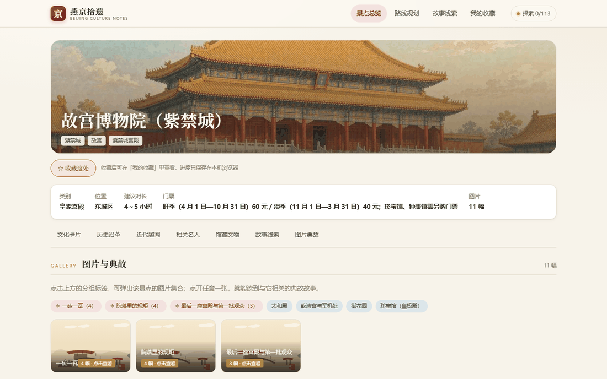
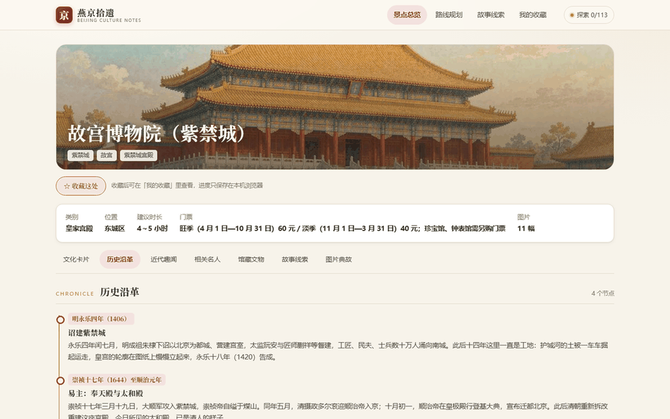
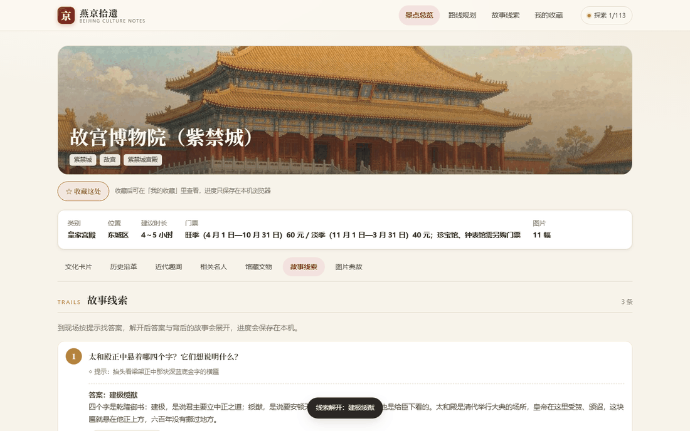
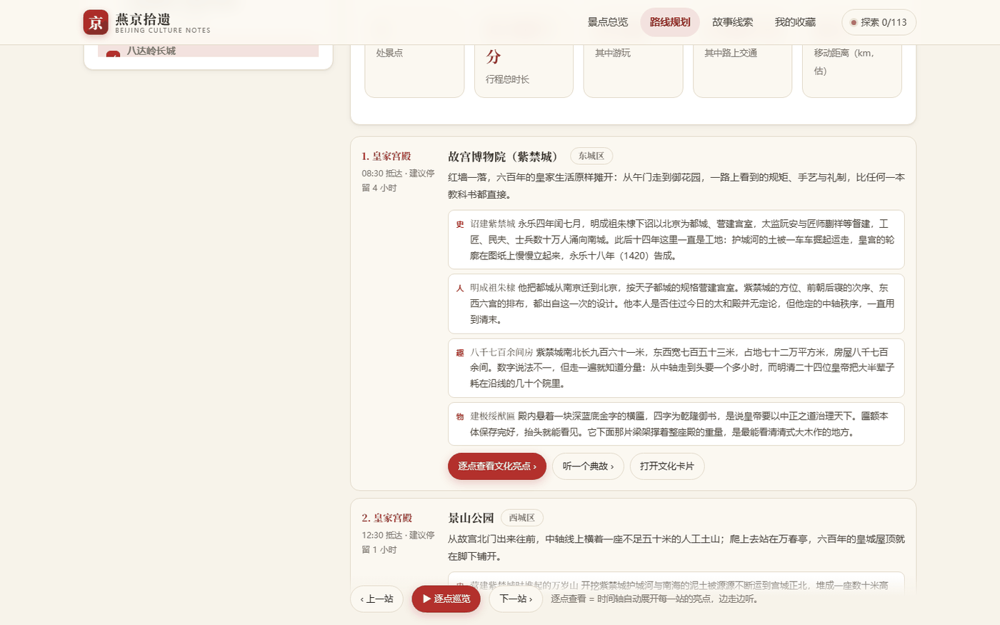
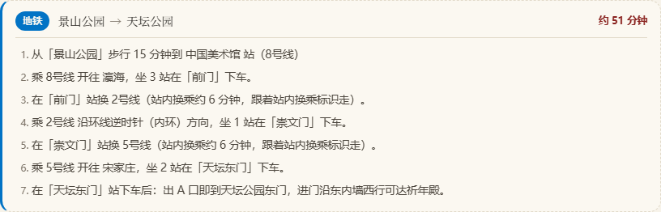
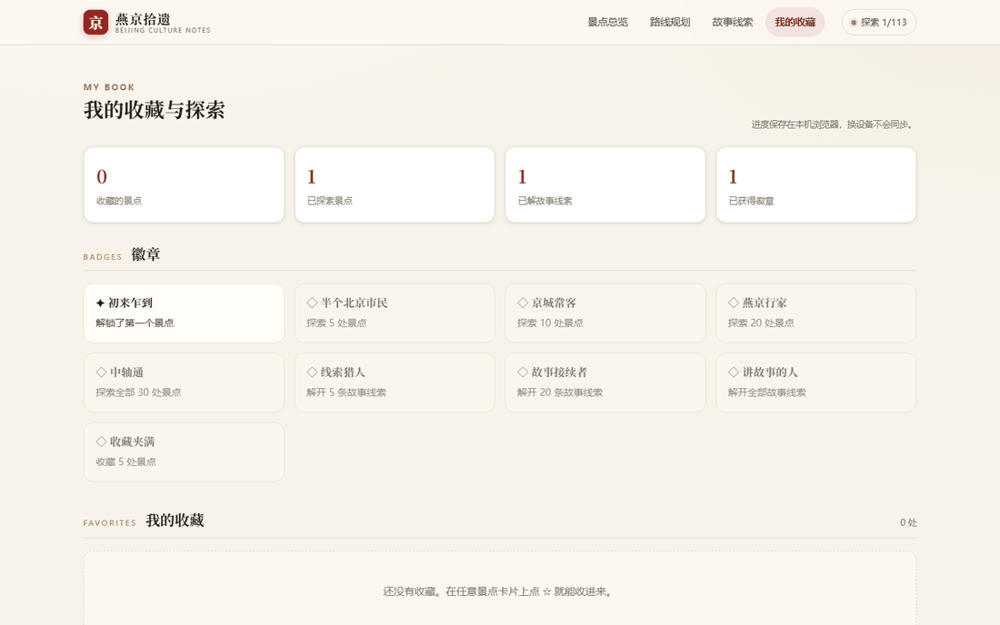

# 燕京拾遗 · 北京文化知识科普旅行

> 覆盖 30 处北京景点，为每处建立文化知识卡片，并在路线规划的每一站把历史、人物、趣事、文物串起来讲。核心差异化：问题导向的**现场线索机制**（到现场找答案打卡，解锁背后的典故故事）+ **带完整交通衔接的路线规划**。


**在线预览**：<https://yanjing-shiyi.app.workbuddy.host/>（在线预览，需联网；本地双击 `index.html` 可完全断网运行）

---

## 一、这个应用解决什么

| 传统旅行 | 燕京拾遗 |
| --- | --- |
| 到了景点看牌子，拍照走人 | 每个景点有「历史沿革 / 近代趣闻 / 相关名人 / 馆藏文物与遗迹」四张内容卡片 |
| 不知道看什么、听什么 | 每个景点预设**故事线索**，到现场按提示找答案，解开后典故自动展开 |
| 路线靠导航，看完就忘 | 规划路线时每一站都带**该景点的文化亮点**，并可逐点巡览 |
| 交通衔接靠自己查 | 相邻景点自动判定步行 / 地铁 / 公交，输出完整换乘文案与耗时 |
| 图片一划而过 | 点击景点标签弹出**图片集合**，点开任意一张即可阅读背后的**典故故事** |

---

## 二、功能清单

1. **景点总览** —— 30 张文化卡片墙，支持按 6 大类筛选、全文搜索（可搜景点 / 名人 / 典故），卡片墙与地图两种视图。
2. **文化卡片详情页** —— 七个分区：文化卡片 / 历史沿革（时间轴）/ 近代趣闻 / 相关名人 / 馆藏文物与遗迹 / 故事线索 / 图片典故。
3. **故事线索系统** —— 每个景点预设线索，现场打卡后答案与故事展开；6 条贯穿全城的故事线（中轴线、长城、皇家园林、博物馆、寺塔、城与园）在「故事线索」页串联展示。
4. **路线规划** —— 勾选景点后自动生成行程：给出抵达时间、建议停留时长、路上交通耗时；每一站列出历史 / 人物 / 趣事 / 文物四条文化亮点，可逐点查看、听典故、打开文化卡片。
5. **图片与典故** —— 点击景点标签弹出图片集合，点开图片进入典故阅读；支持键盘 ← → 切换、Esc 关闭。
6. **我的收藏** —— 收藏、探索记录、线索打卡进度、徽章系统，数据保存在浏览器本地（localStorage）。

### 站点之间的交通衔接

相邻景点按实际距离自动判定三种模式：

- **步行**：实际距离 ≤ 2.0 km 判定为步行。给出直线距离、街区绕行后的实际里程、预计步行时长（实际距离 / 4.6 + 2 分钟路口余量）与方向导向。
- **地铁**：10 条线路真实站序（1 / 2 / 4 / 5 / 6 / 8 / 11 / 14 / 15 / 16 号线），手写 Dijkstra 算出最短路，输出「从哪个站上车 → 乘几号线、开往哪、坐几站 → 在哪个站换哪条线 → 下车后从哪个口出站、出站怎么走」。换乘多的路线会因换线惩罚被自动淘汰（详见第七章）。地铁站锚点表覆盖 25 处景点，出站步行导向逐条写清出口与转向。
- **公交**：7 个远郊景点给出主干线路与替代方案。

---

## 三、快速开始

**方式一：双击运行（推荐，零依赖）**

直接双击 `index.html`，浏览器打开即可使用，无需安装任何东西，可完全断网。

**方式二：本地静态服务**

```bash
# 在项目根目录执行
python -m http.server 8848
# 然后浏览器访问 http://localhost:8848/
```

> 说明：运行时零外部依赖、零 CDN。`node_modules/`（仅含测试用的 `jsdom`）删掉也不影响双击运行；`npm` 仅用于跑测试。

---

## 四、截图一览

> 共 9 张，分置于对应功能章节附近。

**首页** — 
Hero 标语 + 统计（30 处景点 / 275 图片素材 / 83 典故 / 113 线索）+ 「今天先看哪儿」快捷入口 + 30 张文化卡片墙 + 6 大类筛选。

**文化卡片页** — 
景点主视觉 + 基本信息栏（类别 / 位置 / 时长 / 门票 / 图片数）+ 七分区 tab。

**历史沿革** — 
带朝代标签的时间轴。

**故事线索（已解锁）** — 
线索解锁后的状态（答案 + 背后故事展开，顶栏进度 1/113）。

**路线规划** — 
站点步骤含抵达时间、建议停留时长、史 / 人 / 趣 / 物四条文化亮点、逐点查看 / 听典故 / 打开文化卡片三个操作。

**交通衔接** — 
完整地铁方案文案（例：景山公园 → 天坛公园，约 51 分钟，含 8 号线 → 2 号线 → 5 号线两次换乘、上下车站名、环线内外环方向、出站步行导向）。

**故事线总览** — 
6 条贯穿全城的故事线 + 探索进度。

**我的收藏** — 
收藏列表 / 线索打卡进度 / 徽章系统。

**图片兜底** — 
图片资源 404 时自动替换为程序化生成的国风 SVG 插画，不出现破图。

---

## 五、技术架构

纯前端 hash 路由 SPA，**运行时零依赖**，全量扫描确认**零外部 CDN**（CSS 走系统字体栈，图标是内联 data-URI SVG）。

### 分层

| 层 | 职责 |
| --- | --- |
| 数据层 `data.js` | 构建产物，暴露 `BJT.data`：`ready()` / `all()` / `byId(id)` / `randomId()` / `stats()` |
| 交通层 `transit.js` | 地铁站序、Dijkstra 寻路、步行 / 地铁 / 公交判定 |
| 插画层 `svgart.js` | 确定性国风 SVG 兜底引擎 |
| 状态层 `store.js` | localStorage 读写、收藏 / 线索进度 |
| 视图层 `ui.js` + `views/*` | 渲染与交互 |
| 启动层 `app.js` | 路由、初始化 |

### 目录结构

```text
beijing-culture-travel/
├── index.html              # 应用入口，11 个 <script> 顺序加载
├── README.md
├── LICENSE                 # 代码 MIT
├── CONTENT-LICENSE         # 内容 CC BY-NC-ND 4.0
├── TECHNICAL.md            # 技术细节 / 踩坑记录
├── CONTRIBUTING.md
├── package.json            # 唯一 devDependency: jsdom
├── selftest.html           # 浏览器内自检页
├── assets/
│   ├── css/
│   │   ├── base.css
│   │   ├── components.css
│   │   └── views.css
│   ├── js/
│   │   ├── data.js         # 36 行（构建产物）
│   │   ├── transit.js      # 462 行 交通模块
│   │   ├── svgart.js       # 396 行 SVG 兜底引擎
│   │   ├── store.js        # 112 行 状态层
│   │   ├── ui.js           # 282 行
│   │   ├── app.js          # 142 行 启动 / 路由
│   │   └── views/
│   │       ├── home.js
│   │       ├── spot.js
│   │       ├── plan.js
│   │       ├── storyline.js
│   │       └── collection.js
│   └── img/spots/          # 30 张主视觉图（AI 生成）
├── data/
│   └── part_1.json … part_6.json   # 原始内容数据
├── docs/
│   └── screenshots/        # 9 张截图
├── tools/
│   ├── DATA_SPEC.md        # 数据规范
│   ├── smoke.js            # ① 语法 / 数据完整性 / 静态资源
│   ├── logic-test.js       # ② 数据 API / SVG / 状态层 / 覆盖度
│   ├── transit-test.js     # ② 交通完整性 / 文案 / 870 方向
│   ├── clue-test.js        # ② 线索解开 / 收回回归
│   ├── imgfallback-test.js # ② 图片 404 兜底
│   ├── runtime-test.js     # ③ jsdom 真实 DOM 冒烟
│   ├── data/coords.txt     # 坐标真值
│   └── transit-sources/    # 交通站序核实资料
└── .github/workflows/
```

### 脚本加载顺序约束

`index.html:75-85` 共 **11 个 `<script>`**，全部**无 `defer` / `async` / `type=module`**，纯顺序阻塞加载 —— **顺序即依赖**：

```text
data.js → transit.js → svgart.js → store.js → ui.js
       → views/home.js → views/spot.js → views/plan.js
       → views/storyline.js → views/collection.js → app.js
```

> 不能在 `app.js` 之前引用 `BJT.app` 等命名空间；视图层依赖 `data / transit / art / store / ui` 全部就绪后才能挂载。`BJT` 命名空间包含：`data` / `transit` / `art` / `store` / `ui` / `app` / `views` / `THREADS`。

---

## 六、🩸 路径规划算法

这是本项目的技术核心。下面把「怎么判定模式」到「怎么选路」完整写透。

### 6.1 判定流程

1. 取两景点经纬度，用 Haversine 算出直线距离 `d`。
2. 计算街区绕行实际步行距离：`road = d × ROAD`（绕行系数 1.35）。
3. 若 `road ≤ WALK_REAL_MAX`（2.0 km）→ **步行**；否则进入地铁 / 公交判定。
4. 地铁可达（两端都有景区站锚点）→ 用 Dijkstra 求最短路 → **地铁**；远郊无地铁覆盖的 7 处 → **公交**。

### 6.2 五个关键常量（全部在 `assets/js/transit.js:185-190`）

| 常量 | 值 | 含义 |
| --- | --- | --- |
| `ROAD` | 1.35 | 街区绕行系数（直线距离 → 实际步行距离） |
| `WALK_REAL_MAX` | 2.0 km | 实际距离 ≤ 此值判为步行 |
| `WALK_KMH` | 4.6 | 步行速度（km/h） |
| `RIDE_PER_HOP` | 3 min | 地铁每站运行 + 停站 |
| `TRANSFER_MIN` | 6 min | 站内换乘 |
| `LINE_CHANGE_PENALTY` | 5 | 换线惩罚（寻路用） |

耗时公式：

- 步行耗时 = 实际距离 / 4.6 + 2 分钟路口余量
- 地铁耗时 = 候车 4 + 每站 3 × N + 每次换乘 6 + 两端站点到景区步行

### 6.3 Dijkstra + 换线惩罚

手写 Dijkstra（`transit.js:258-281`）：节点 = 地铁站，边权 = 站间 3 分钟。**换线额外加 `LINE_CHANGE_PENALTY = 5` 分惩罚**。

```js
// 伪代码：边权累加换线惩罚
function edgeWeight(from, to, line) {
  let w = RIDE_PER_HOP;                 // 3 min / hop
  if (line !== prevLine) w += LINE_CHANGE_PENALTY; // +5 换线
  return w;
}
```

### 6.4 为什么换线惩罚不是可选项

**雍和宫 → 天坛** 是一个能说明工程判断力的真实案例。

如果只按「站数最少」寻路，两条路线权重完全相同（都是 8 站 × 3 分钟 = 24 分钟）。Dijkstra 平局时会**任意选一条**，可能给出「2 号线 → 1 号线 → 5 号线，3 次换乘 42 分钟」的方案。

加上 `LINE_CHANGE_PENALTY = 5` 后，「站数相同但换乘更少」的路线胜出，输出变为：

> 乘 **5 号线** 开往 宋家庄，坐 8 站在 **天坛东门** 下车

—— **同样里程，换乘 0 次**。

这说明最短路算法在这里必须把换乘成本**显式建模**，否则算出来的「最优」会给出更差的体验。换线惩罚把「少换乘」变成可比较的硬成本，消除了平局歧义。

### 6.5 环线处理

2 号线 `stops` 首尾都是「西直门」。建图时 `stops.slice(0, -1)` 去重并补一条回边；方向文案用「顺时针（外环）/ 逆时针（内环）」，非环线用「开往 XX 站」。

### 6.6 换乘站自动识别

**换乘站不需要单独维护表** —— 同一站名出现在多条线的 `stops` 里就自动成为换乘站。建图时维护两个索引：

- `IDX[站名] = [{line, i}]`：站名 → 所属线路与序号
- `ADJ[站名] = [{to, line, w}]`：站名 → 邻接边

这样新增一条线路只要填站序，换乘关系零手工维护。

### 6.7 一个踩坑记录（详见 `TECHNICAL.md`）

故事线索的「解开 / 收回」按钮曾失效：`paintBody()` 用 `body.innerHTML = '...'` 整体替换 `#spotTabBody`，把按钮连同 `addEventListener` 监听器一起销毁；而点击回调里只调了 `paintBody()`、漏了重新绑定。结果第 1 次点击生效、第 2 次「点击收回」无反应，且同一列表其他线索按钮一起失效。修法是把绑定拆成 `mount()`（绑 body 外元素）+ `mountBody()`（绑 body 内元素），重绘后补绑，并补了 23 项回归测试。

---

## 七、数据规范

景点对象 17 个字段（详见 `tools/DATA_SPEC.md`）：

| 字段 | 类型 | 说明 |
| --- | --- | --- |
| `id` | string | 唯一标识 |
| `name` | string | 景点名 |
| `alias[]` | string[] | 别名 |
| `category` | string | 6 大分类之一 |
| `district` | string | 所在区 |
| `visitTime` | string | 建议游玩时长 |
| `ticket` | string | 门票信息 |
| `coords[2]` | number[] | 经纬度 [lng, lat] |
| `summary` | string | 一句话简介 |
| `cover` | string | 主视觉图路径 |
| `highlights[6]` | string[] | 6 条文化亮点 |
| `clues[]` | array | 故事线索 |
| `history[]` | array | 历史沿革 |
| `figures[]` | array | 相关名人 |
| `artifacts[]` | array | 馆藏文物与遗迹 |
| `facts[]` | array | 近代趣闻 |
| `stories[]` | array | 典故故事 |
| `galleries[]` | array | 图片集合 |

6 个内容数组结构：

| 数组 | 元素字段 |
| --- | --- |
| `clues[]` | `q` / `hint` / `answer` / `reveal` |
| `history[]` | `era` / `title` / `text` |
| `figures[]` | `name` / `role` / `text` |
| `artifacts[]` | `name` / `where` / `text` |
| `facts[]` | 字符串（近代趣闻） |
| `stories[]` | `id` / `title` / `subtitle` / `text` |
| `galleries[]` | `name` + `items[]`: `caption` / `story` / `image` |

6 大分类：皇家宫殿 / 长城关隘 / 皇家园林 / 城市场景 / 博物馆艺文 / 宗教古迹。
单景点内容量 1600–2400 字。

---

## 八、内容规模

| 维度 | 数量 |
| --- | --- |
| 景点 | 30 处 |
| 历史沿革 | 158 节点 |
| 近代趣闻 | 115 条 |
| 相关名人 | 106 位 |
| 馆藏文物与遗迹 | 131 项 |
| 故事线索 | 113 条 |
| 典故故事 | 83 篇 |
| 图片位 | 275 |
| 贯穿故事线 | 6 条（中轴线 / 长城 / 皇家园林 / 博物馆 / 寺塔 / 城与园） |
| 景区地铁站锚点 | 25 个 |
| 远郊公交方案 | 7 个 |

---

## 九、图片策略

图片缺失或加载失败时，原地替换为程序化生成的国风 SVG 插画（800×500）。

- 用 **FNV-1a 哈希 + mulberry32 确定性伪随机**（见 `svgart.js`，共 396 行）。
- **同一景点 `id` 永远得到同一张图**，提供视觉一致性。
- 内置 8 种场景模板，按 `id` 哈希分流。
- 效果：断网不缺图、绝不出现浏览器破图图标（见截图 `09-svg-fallback.png`）。

---

## 十、测试

6 套测试，`npm test` 全绿。测试脚本自带静态服务（端口占用则复用），一条命令跑完。坐标真值数据在 `tools/data/coords.txt`。

| 套件 | 级别 | 覆盖 |
| --- | --- | --- |
| `tools/smoke.js` | ① | JS 语法 / 数据完整性 / 静态资源可达 |
| `tools/logic-test.js` | ② | 数据 API / SVG 插画引擎 / localStorage 状态层 / 内容覆盖度 |
| `tools/transit-test.js` | ② | 交通数据完整性 / 15 个关键路段文案 / **870 方向全覆盖（19 项）** |
| `tools/clue-test.js` | ② | 线索「解开 → 收回 → 再解开」反复切换 / 多线索互不干扰 / 切 tab 仍可用（23 项） |
| `tools/imgfallback-test.js` | ② | 图片全部 404 时 SVG 兜底是否生效 |
| `tools/runtime-test.js` | ③ | jsdom 真实 DOM：5 条路由 + 30 个详情页 + 交互 + **`file://` 离线冒烟** |

交通覆盖分布：`walk 32 / metro 568 / bus 270`（30×29 = 870 个方向全覆盖）。

### 如何运行

```bash
npm test          # 跑全部 6 套
node tools/smoke.js
```

### 为什么不用 mock 服务层

本项目**没有后端、没有服务层**，运行的就是 `index.html` 直接加载的那批静态文件。测试刻意用 jsdom 加载**真实的** `index.html` 与 `assets/js/*`，验证的是「双击打开后这些文件是否真的能跑起来」——包括 `file://` 离线冒烟。一旦引入 mock，测的就是被替换过的假对象，反而测不到「零依赖、可断网」这个最核心的承诺。因此测试一律走真实模块与真实 DOM，不 mock。

---

## 十一、⚠️ 授权与使用

**这章是法务关键，请先读再使用。**

- **代码** 采用 **MIT**，见 [`LICENSE`](LICENSE)。你可以自由使用、修改、再分发，包括商业用途。
- **内容** 采用 **CC BY-NC-ND 4.0**，见 [`CONTENT-LICENSE`](CONTENT-LICENSE)。**禁止商业使用、禁止演绎、转载需署名。** 内容指：30 处景点的历史 / 趣闻 / 名人 / 文物文本、113 条线索、83 篇典故、25 条出站步行导向文案、7 条郊县公交方案，以及「线索机制」这一产品设计。
- **不受限的**：地铁线路站序、站点经纬度、票价、开放时间等**客观事实信息**，属于公共事实，不受上述内容授权约束。
- 一句话讲明白：**代码可以随便拿去商用，内容不可以。**

---

## 十二、内容来源与免责

- 内容为原创二次创作，事实以公开史料与各馆公开介绍为据，争议处标注「相传」「据载」。
- 30 张主视觉图为 **AI 生成**。
- 交通信息（站序、公交线路、班次）来自公开资料整理（站序来源：bjsubway.com / mtr.bjmn / 维基百科多来源交叉核对，原始核实资料留档在 `tools/transit-sources/`）。**会随运营调整变化，不含首末班车实时校验，出行前请以北京地铁官方 App 与公交运营方信息为准**；方案耗时为模型估算。
- 收藏 / 线索进度存在浏览器 localStorage，换设备不同步。
- 地图视图为经纬度投影方位示意图，非实际地形比例。

---

## 十三、贡献

欢迎提 Issue 与 PR。数据格式、提交规范、本地验证流程见 [`CONTRIBUTING.md`](CONTRIBUTING.md)。修改内容数据请先读 [`tools/DATA_SPEC.md`](tools/DATA_SPEC.md)。

---

## 十四、商业合作

内容授权（非代码）可洽谈以下两种授权包：

- **单景点线索 + 典故包**：单处景点的线索设计与典故故事授权；
- **30 景点完整内容包**：全量内容一次性授权。

授权范围、署名方式与价格请邮件联系：**{{你的邮箱}}**。

---

## 十五、License

- **代码** —— [MIT](LICENSE)
- **内容（文本 / 线索 / 典故 / 交通文案 / 产品设计）** —— [CC BY-NC-ND 4.0](CONTENT-LICENSE)

详情分别见 [`LICENSE`](LICENSE) 与 [`CONTENT-LICENSE`](CONTENT-LICENSE)。
