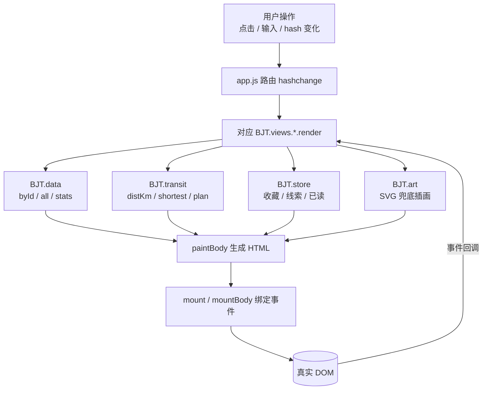

# 技术文档（TECHNICAL）

> 燕京拾遗 · 北京文化知识科普旅行 —— 纯前端静态应用，运行时零依赖，可离线双击 `index.html` 使用。

本文面向接手或二次开发本项目的工程师，覆盖架构、交通算法、程序化插画、状态层、踩坑记录与测试策略。

---

## 一、架构总览

### 1.1 运行模型

- **零依赖运行时**：线上 `assets/` 与 `index.html` 全量扫描无外部 CDN，所有逻辑由本地 `.js` 完成，断网可用。
- **顺序阻塞加载**：`index.html:75-85` 共 11 个 `<script>`，**全部无 `defer`/`async`/`type=module`**，因此「脚本顺序即依赖顺序」：

```
data.js(75) → transit.js(76) → svgart.js → store.js → ui.js
           → views/home.js → views/spot.js → views/plan.js
           → views/storyline.js → views/collection.js → app.js(85)
```

- **hash 路由**：页面无后端，靠 `location.hash`（`#/`、`#/spot/:id/:tab`、`#/plan` 等）驱动视图切换，`app.js` 监听 `hashchange` 后调用对应 `BJT.views.*.render`。

### 1.2 全局命名空间 `BJT`

所有模块挂载到单一全局对象 `window.BJT`，避免污染全局：

| 命名空间 | 来源文件 | 职责 |
|----------|----------|------|
| `BJT.data` | data.js | 数据层：5 个 API（见下） |
| `BJT.transit` | transit.js | 交通计算：距离、最短路径、方案文案 |
| `BJT.art` | svgart.js | `BJT.art(spot, ...)` 生成兜底插画 |
| `BJT.store` | store.js | localStorage 状态层（收藏/线索/已读） |
| `BJT.ui` | ui.js | 工具函数（`esc`、`$$`、`toast`、`openStory` 等） |
| `BJT.app` | app.js | 路由、启动、`refreshChrome` |
| `BJT.views` | views/*.js | 各页面视图（home/spot/plan/storyline/collection） |
| `BJT.THREADS` | app.js / data | 6 条故事线 |

`BJT.data` 的 5 个 API：`ready()` / `all()` / `byId(id)` / `randomId()` / `stats()`。

### 1.3 数据流（Mermaid）



要点：**视图层只产出 HTML 字符串并写入 `root`，事件通过 `mountBody` 重新绑定**（见第五节踩坑记录）。数据、交通、状态三层均为纯函数，不触碰 DOM，因此可被测试直接调用。

---

## 二、交通模块详解（transit.js）

交通是本项目的算法核心，负责「两景点之间怎么走、怎么用文字告诉用户」。

### 2.1 五个计算常量

| 常量 | 行号 | 值 | 含义 |
|------|------|-----|------|
| `ROAD` | transit.js:185 | `1.35` | 街区绕行系数：直线距离 → 实际步行距离 |
| `WALK_REAL_MAX` | :186 | `2.0` km | 实际步行距离 ≤ 此值判「可步行」 |
| `WALK_KMH` | :187 | `4.6` | 正常步速 |
| `RIDE_PER_HOP` | :189 | `3` 分钟 | 地铁每站（运行 + 停站） |
| `TRANSFER_MIN` | :190 | `6` 分钟 | 站内换乘（出站换向、安检） |
| `LINE_CHANGE_PENALTY` | :190 | `5` 分钟 | 路网寻路时的**换线惩罚** |
| `BOARD_WAIT` | :191 | `4` 分钟 | 候车进站 |

### 2.2 判定与耗时公式

- **步行判定**：`road = Haversine(直线距离) × ROAD`；若 `road ≤ 2.0km` 判步行。
- **步行耗时**：`road / 4.6 × 60 + 2`（分钟，含 2 分钟路口余量）。
- **地铁耗时**：`候车 4 + 每站 3×N + 每次换乘 6 + 两端站点到景区步行`。

### 2.3 建图（build）

- 数据来源：bjsubway.com / mtr.bjmn / 维基百科多来源交叉核对，原始核实资料留档于 `tools/transit-sources/`（4 份 JSON）。
- 节点 = 地铁站；邻接表 `ADJ[站名] = [{to, line, w}]`，权重 `w = RIDE_PER_HOP = 3`。
- **换乘站无需单独维护表**：同一站名出现在多条线的 `stops` 里，`IDX[站名] = [{line, i}]` 自动累积；寻路时跨线即触发换乘。
- **环线处理**：2 号线 `stops` 首尾都是「西直门」。建图时 `loop ? stops.slice(0, -1) : stops` 去掉重复的收尾站，并补一条「末站 → 首站」回边（transit.js:224、:232-234）。方向文案用「沿环线顺时针（外环）/逆时针（内环）」，而非环线用「开往 XX」（`dirText`，:241-249）。

### 2.4 最短路径（手写 Dijkstra，transit.js:258-281）

节点为地铁站，`dist[]` 初值 `Infinity`，每次取未访问最小 `dist` 的节点松弛邻接边。关键在权重：

```js
// transit.js:277-279
var extra = (pLine[u] && pLine[u] !== nb[m].line) ? LINE_CHANGE_PENALTY : 0;
var alt = dist[u] + nb[m].w + extra;
```

即：若本次移动**换了一条线**，额外加 5 分钟。这样「站数相同但换乘更少」的路线会在最短路比较中胜出。

### 2.5 真实案例：雍和宫 → 天坛（换线惩罚不是锦上添花）

只按「站数最少」寻路时，平局会选到 **「2 号线 → 1 号线 → 5 号线，3 次换乘 42 分钟」** 的路线——站数并不更多，但用户体验极差。

引入 `LINE_CHANGE_PENALTY = 5` 后，同样是 24–30 分钟区间，算法改为输出 **「5 号线直达 8 站」**：

> 乘 5 号线 开往 宋家庄，坐 8 站在天坛东门下车

**结论**：换线惩罚是必需项。若移除它，最短路会收敛到「换乘最多但站数打平」的劣解，直接损害用户出行体验。

### 2.6 方案覆盖率

交通方案覆盖率测试覆盖 870 个方向（30×29 两两组合），模式分布：`walk 32 / metro 568 / bus 270`，无遗漏方向。

---

## 三、程序化国风插画（svgart.js）

当图片缺失或离线时，自动生成该景点的国风 SVG 兜底插画（约 800×500），保证「断网不缺图、不破图」。

### 3.1 确定性原理

同一景点 id **永远得到同一张图**，刷新不跳变。核心两步：

```js
// 1) FNV-1a 哈希：把 id 字符串变成 32 位无符号整数种子
function hash(str) {
  var h = 2166136261;                       // FNV offset basis
  for (var i = 0; i < str.length; i++) {
    h ^= str.charCodeAt(i);
    h = (h * 16777619) >>> 0;               // FNV prime
  }
  return h >>> 0;
}

// 2) mulberry32：由种子派生确定性伪随机函数
function rng(seed) {
  var a = seed >>> 0;
  return function () {
    a = (a + 0x6D2B79F5) >>> 0;
    var t = a;
    t = Math.imul(t ^ (t >>> 15), t | 1);
    t ^= t + Math.imul(t ^ (t >>> 7), t | 61);
    return ((t ^ (t >>> 14)) >>> 0) / 4294967296;
  };
}
```

- `seed = hash(spot.id)` → `r = rng(seed)`；
- 同一 `id` → 同一 `seed` → 同一 `r` 序列 → 同一幅画。
- 5 套配色（`PALETTES`）+ 8 种场景模板（按 `category` 选择：宫殿/园林/关隘/城市场景/博物馆/宗教古迹等），由 `r()` 决定山峦起伏、云层位置、屋檐比例等细节。

### 3.2 调用

视图里写 `BJT.art(spot, fallbackImage, width, height)`：有 `fallbackImage` 用之，否则生成 SVG 字符串直接内联。

---

## 四、状态层与降级策略（store.js）

- 封装 `localStorage` 的收藏、线索解开、已读景点等状态。
- **降级不抛错**：检测到 `localStorage` 不可用时（如某些浏览器 `file://` 限制），自动回退到内存对象，调用方无感知，`file://` 双击打开仍可用。
- 测试见 `runtime-test.js` 第 [7] 组，专门跑 `file://` 会话验证「双击 index.html」路径下状态不崩。

---

## 五、踩坑记录：spot.js 线索「解开/收回」按钮失效

### 5.1 症状

景点页（spot）「故事线索」标签页中，点击「我在现场，解开线索」按钮：

- 第 1 次点击生效；
- 第 2 次点击「点击收回」**毫无反应**；
- 同列表里**其他线索按钮也一起失效**。

### 5.2 根因

`paintBody()` 的实现是 `body.innerHTML = '...'`——**整体替换 `#spotTabBody` 的 DOM**，旧按钮及其 `addEventListener` 监听器随旧节点一起被销毁。

原代码 `render()` 里是 `paintBody(); mount();` 两步，但点击回调里**只调了 `paintBody()`、漏了 `mount()`**。于是第 1 次靠 `render` 时绑好的监听器还能用；一旦点击触发重绘，新 DOM 没有任何监听器，按钮全部「死」掉。

### 5.3 修法

把绑定逻辑拆成两半，避免重复绑定导致收藏按钮双 toggle：

- `mount(root, spot, tab)`：先 `paintBody()`，只绑 `#spotTabBody` **之外**的收藏按钮（重绘不会销毁它，故只绑一次），再调 `mountBody()`。
- `mountBody(root, spot, tab)`：绑定 `#spotTabBody` **内部**所有按钮（线索 toggle、典故、画廊、跳转故事）。
- 点击回调里：`paintBody()` 之后**必须紧跟 `mountBody()`** 补绑（spot.js:238-239）：

```js
btn.addEventListener('click', function () {
  var i = parseInt(btn.getAttribute('data-toggle-clue'), 10);
  var done = BJT.store.toggleClue(spot.id, i);
  // ...更新 UI...
  BJT.app.refreshChrome();
  paintBody(root, BJT.data.byId(spot.id), tab);  // 重绘会清空旧监听器
  mountBody(root, BJT.data.byId(spot.id), tab);  // 必须补绑，否则按钮失效
});
```

### 5.4 如何用测试防回归

补了 23 项回归测试（`clue-test.js`，覆盖 spot 线索交互），关键断言：

- 解开 → 收回 → 再解开，反复切换状态正确；
- 多条线索互不干扰（A 解开不影响 B 的按钮）；
- 切 tab 再切回，按钮仍可用；
- 收藏按钮无重复绑定（不会一次点击触发双 toggle）。

---

## 六、测试策略（6 套，npm test 全绿）

| # | 文件 | 边界 | 为什么这样划 |
|---|------|------|--------------|
| 1 | smoke.js | 语法 + 数据完整性 + 静态资源存在性 | 最廉价地挡住「文件丢了 / 数据坏了」 |
| 2 | logic-test.js | 数据 API / SVG 引擎 / 状态层 | 纯函数层，不依赖 DOM |
| 3 | transit-test.js | 交通层 19 项 | 含环线、换乘、换线惩罚案例 |
| 4 | clue-test.js | 线索交互 23 项 | 覆盖第五节按钮失效回归 |
| 5 | imgfallback-test.js | 图片 404 兜底 | 验证 `svgart` 不破图 |
| 6 | runtime-test.js | jsdom 真实 DOM + `file://` 离线 | 第 [7] 组专跑双击路径 |

**为什么不用 mock 服务层**：本应用没有后端、没有网络请求，数据全在本地 `BJT.data`。所谓「服务层」就是纯函数，直接调用比 mock 更真实；`runtime-test.js` 用 jsdom 在接近真实 DOM 的环境里跑完整渲染，比桩测试更能发现第五节这类 DOM 生命周期 bug。

---

## 七、如何扩展

### 7.1 新增一个景点

在 `data/` 的数据源里追加一个景点对象（17 字段）：

```
id / name / alias[] / category / district / visitTime / ticket /
coords[纬度, 经度] / summary / cover / highlights[≤6] / clues / history /
figures / artifacts / facts / stories / galleries
```

`coords` 用 `[lat, lng]` 顺序（与 `transit.distKm` 的 Haversine 一致）。数据合法性由 `smoke.js` 与 `logic-test.js` 兜底。

### 7.2 新增一条地铁线路

在 `transit.js` 的 `LINES` 里加一项 `{ name, term:[起,终], stops:[...], loop?:true }`：

- 普通线：`stops` 按站序排列，首尾为终点站；
- 环线：设 `loop:true`，`stops` 首尾同名（建图时自动去重 + 补回边）；
- 换乘站**无需特殊处理**：只要站名出现在多条线 stops 中即自动成为换乘节点。

来源资料请同步补到 `tools/transit-sources/` 并注明出处（见 CONTRIBUTING.md）。
